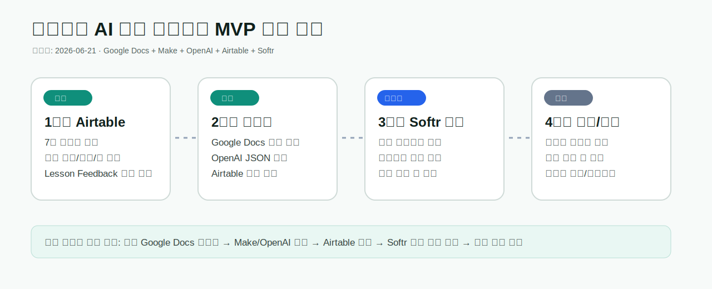

# SpeakMate Academy / English Academy MVP

이 저장소는 두 가지를 함께 보관합니다.

1. GitHub Pages로 배포된 영어 회화 연습 웹앱 `SpeakMate Academy`
2. 영어학원 원장 의뢰용 노코드 학습 대시보드 MVP 구축 문서와 제안서

## Deployed SpeakMate App

```text
https://waterfirst.github.io/SpeakMate-Academy/
```

SpeakMate 웹앱은 한국인 영어 학습자를 위한 브라우저 기반 회화 연습 도구입니다.

주요 기능:

- 음성 녹음 및 재생
- 브라우저 Web Speech API 기반 live transcript
- 문장 교정 및 질문 적합도 평가
- 남성/여성 코치 선택
- 상황별 회화 연습 주제
- 관리자 잠금 영역과 Make/Airtable 저장 테스트

## English Academy MVP Direction

원장 의뢰 프로젝트의 본체는 SpeakMate 웹앱 자체가 아니라, 아래 노코드 운영 흐름입니다.

```text
Google Docs 강사 피드백
→ Make.com 자동화
→ OpenAI 복습자료 생성
→ Airtable 중앙 DB 저장
→ Softr 학생/강사 대시보드
→ 학생 숙제 제출
→ 강사 확인/다운로드
```

SpeakMate 웹앱은 Softr 학생 대시보드 안에서 "말하기 연습 바로가기"로 연결할 수 있는 부가 기능으로 둡니다.

## Current MVP Progress



현재 완료된 내용:

- Airtable `SpeakMate Review Hub` 기본 테이블 구성
- Google Docs → Make → OpenAI → Airtable 저장 성공
- Softr `SpeakMate Student Portal` 생성
- 학생용 복습자료 리스트/상세 화면 구성
- Softr 숙제 제출 폼 → Airtable `Homework Submissions` 저장 성공

다음 작업:

- 학생별 로그인 권한 필터
- 강사 대시보드
- 제출물 다운로드/코멘트
- 원장용 운영 가이드 마감

## Key Documents

- [Google Docs 기반 빠른 MVP 제작 기획안](docs/06_google_docs_mvp_plan_ko.md)
- [구축 기록 및 재현 매뉴얼](docs/07_build_history_and_rebuild_manual_ko.md)
- [Airtable schema](docs/01_airtable_schema_ko.md)
- [Make.com scenarios](docs/02_make_scenarios_ko.md)
- [Maintenance guide](docs/03_maintenance_guide_ko.md)
- [Quote and scope](docs/04_quote_and_scope_ko.md)
- [SpeakMate webhook payload](docs/05_speakmate_webhook_payload_ko.md)

## Proposal

최종 제안서 DOCX는 `proposals/` 폴더에 보관합니다.

```text
proposals/english_academy_mvp_proposal_final_20260621.docx
```

제안서에는 다음 조건을 명시합니다.

- 이번 건은 첫 파일럿 구축 사례이므로 구축비는 다소 낮게 제안
- SaaS 구독료와 OpenAI API 사용료는 원장 명의 계정에서 별도 부담
- 부가세, 원천징수, 기타 세무 처리 비용은 의뢰자 부담 또는 별도 정산

## Automation Assets

- [OpenAI structured output schema](automation/openai_lesson_feedback_schema.json)
- [Listening pool seed CSV](automation/listening_pool_seed.csv)
- [Teacher feedback template](automation/teacher_feedback_template.md)

## Make / Airtable Storage Notes

SpeakMate 웹앱의 관리자 패널 비밀번호는 `0000`입니다. 관리자 패널에서 Make webhook URL을 넣어 연습기록을 Airtable로 저장할 수 있습니다.

테스트 URL 예시:

```text
?studentId=kim001&lessonId=2026-06-14-B1&level=B1
```

브라우저에 노출되는 webhook URL이나 GitHub token은 강한 보안 수단으로 취급하면 안 됩니다. 실제 운영에서는 Softr 로그인 페이지 안에 SpeakMate를 넣고, Make/Airtable에서 학생 ID를 검증해야 합니다.
